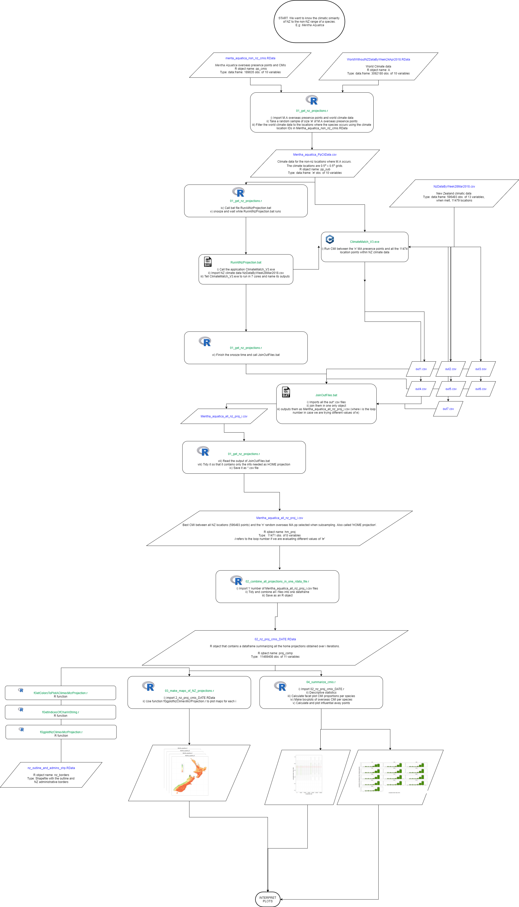
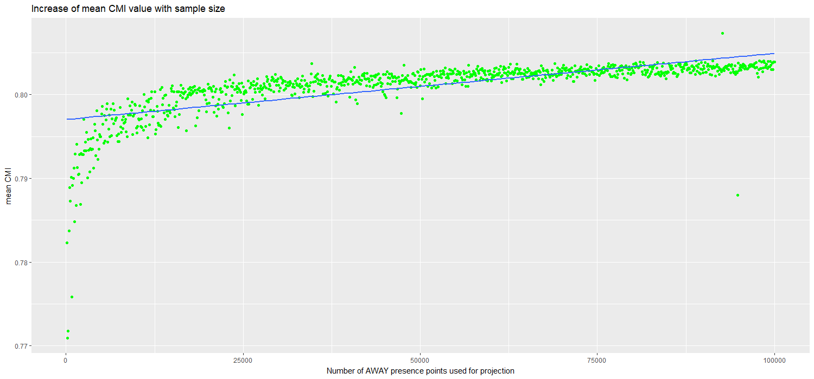
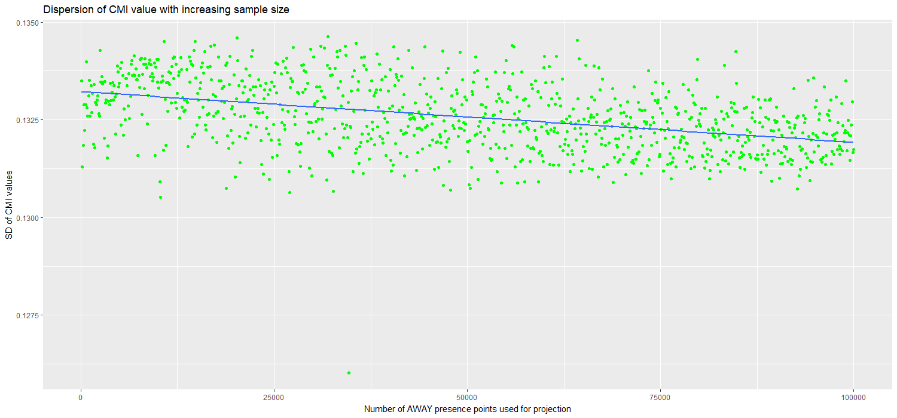
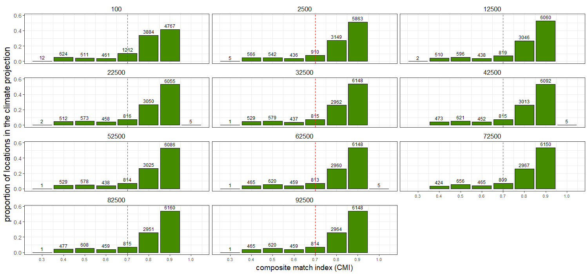
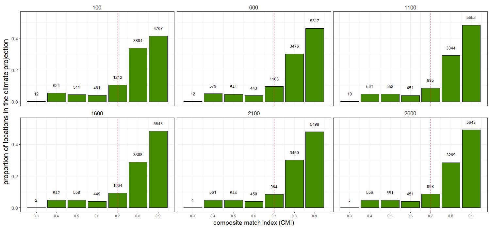
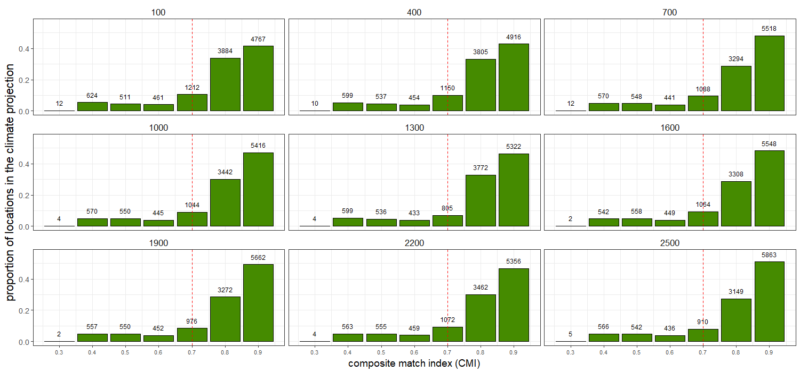
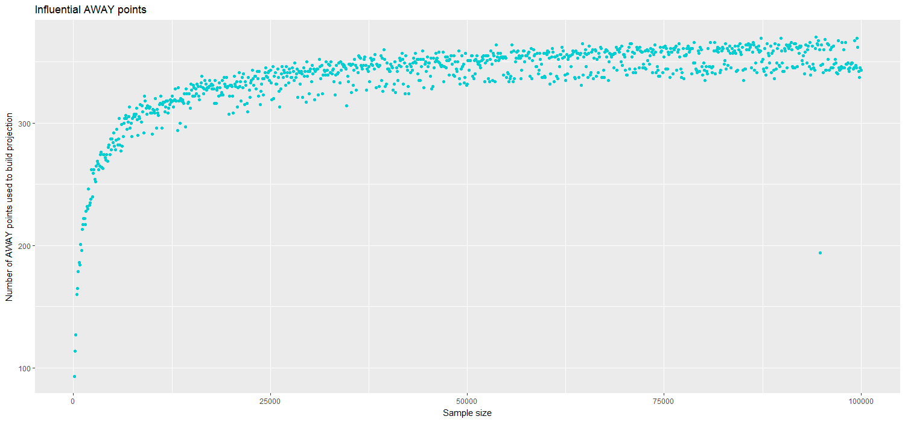

[TITLE]

# Petita prova

# The Match Climates algorithm for pest risk analysis (PRA)

The climatic similarity between two locations can be used to inform a key question in pest risk analysis (PRA). PRA aims to assess the risk that a specific species poses to an area of interest (PRA area). One way to infer whether the species of interest could become established in the PRA area is by comparing the climate of abroad locations where the species is present to the climate of the region of interest.

The match climates algorithm (@Sutherst1985) allows the user to compare the meteorological data from different places. For a given pair of locations, it answers questions such as: Are the extreme minimum and maixmum temperatures similar? Do the two locations have similar amounts of rainfall and similar seasonal rainfall patterns? The numerical output of the algorithm is an index that ranges between 0 (poorly matched) and 1 (perfectly matched).

Climate matching has been widely applied in PRA to estimate the potential geographic distributions of weeds, insects and mites. However, there is a lack of studies that address its predictive validity. A first attempt at evaluating the predictions of CMI for its use in PRA is found in @Phillips2018, which evaluated whereas the predictions of climatic similarity for a list of 35 invasive ants in New Zealand were consistent with its establishment status. @Phillips2018 concluded that using the results of CM seemed to be informative to predict ants invasions in New Zealand. However, few caveats were identified and recommended for further study.

# Sensitiviy Analysis of the CM algorithm

## Climate similarity projection

A specific form of using CMI is to construct projections for a PRA area where the species of concern is not present yet. A projection is a model-derived estimate of the climatic suitability of an area of interest.

The steps to build a projection for a PRA area (HOME) are:
1. Obtain the  presence points where the species is known to be present abroad
2. Divide HOME into a grid of cells with their respective climate data
3. Compare the climate of the AWAY points with the climate of the HOME locations using the CM algorithm
4. Obtain for each of the HOME climate cells, a CMI value (from 0 to 1) that represents the **maximum** climatic similarity obtained between the HOME point when compared to all the AWAY points.

## Case study using the species _Mentha aquatica_

Here we perform a sensitivity analysis of the match climates algorithm to the number of overseas points used in the construction of the HOME projection.

To do so, we chose the species _Mentha aquatica_ because of its large number of overseas presence points (189,835). Then we built 1000 HOME projections, starting with a sample size of 100 AWAY points and increasing it by 100 each iteration until reached a sample size of 100,000. The analysis took over three weeks time to run.

### Number of AWAY points

Hypotheses: More AWAY points mean more one to one comparisons HOME vs AWAY are gonna be carried, increasing the chance of finding a higher CMI value as a best match for each HOME location.

1. Do more away points increase average CMI in the HOME projection?

2. Do more AWAY points decrease the variability of the CMI values obtained in the HOME projection?

3. Is there a minimum amount of AWAY points that ensures a stable projection?

### Number of HOME locations that obtained each CMI values
#### The CMI = 0.7 threshold value

Because CMI ranges between 0 and 1, the 0.7 CMI threshold is generally interpreted as indicating two climates are sufficiently similar for a species to persist in both. However that threshold is rather arbitrary and potentially species specific.

## The importance of the **influential** AWAY points

The influential AWAY points are those overseas points that have matched the most with HOME locations when constructing the projection.

### Proportion of HOME to AWAY locations

[Extracted from @Phillips2018] The number of HOME locations with climates favourable for establishment will generally increase with the proportion of CMIs over 0.7. However, the total number of overseas climate cells from which the proportion for each species was calculated must also be considered when interpreting such data (Fig. 3). For example, Nylanderia vaga (Forel), Strumigenys xenos Brown, Pheidole rugulosa Forel and P. proxima Mayr had CMIs from only three or fewer non-New Zealand locations (Fig. 3). This suggests their distributions were under-represented by the data and, had CMIs for more locations been available, some would likely have been less than 0.7, particularly for tropical or subtropical species such as N. vaga. Thus, the
proportions of CMIs C 0.7 could be too high for these species (Fig. 3).

### Species specificity
Imagine a species  with all its occurrence points very similar to each other. You could assume that species has a very narrow climate range, therefore maybe a 0.7 threshold value is too low and we would be overconsidering the threat it poses to the HOME location. On the contrary, imagine a species that has a very broad climatic range (which could be indicative of niche expansion) and its best match with HOME location is 0.6. Wouldn't it be wise to consider the species for further PRA since it has potential to keep expanding its climatic niche?
One solution could be to correct the CMI threshold by some variability measure of the species climatic niche?

This will also be related to the number of AWAY points used to calculate the projection (more points, more probability of a wider climatic range).
