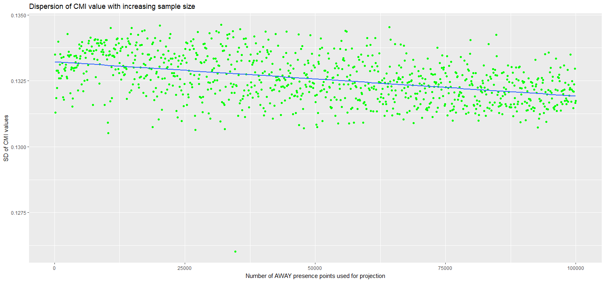
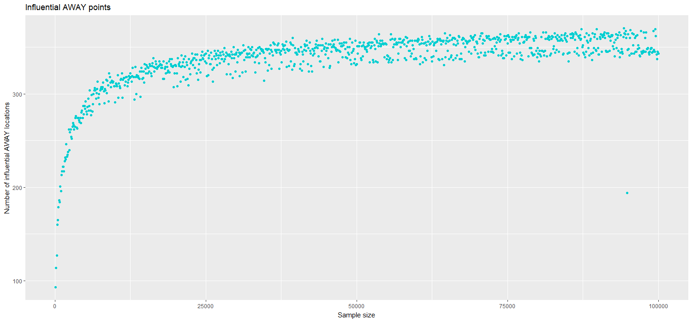
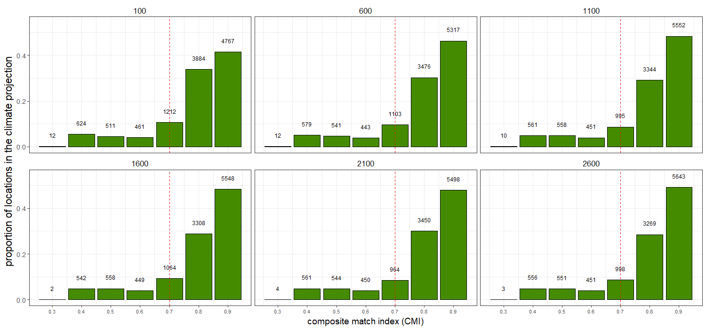
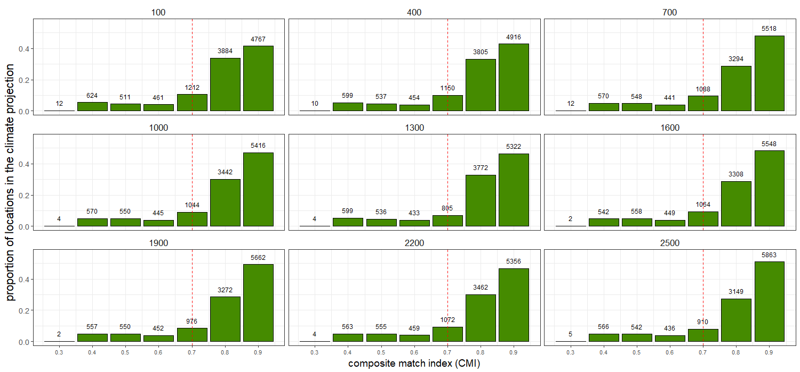

[TITLE]

# The Match Climates algorithm for pest risk analysis (PRA)

The climatic similarity between two locations can be used to inform a key question in pest risk analysis (PRA). PRA aims to assess the risk that a specific species poses to an area of interest (PRA area). One way to infer whether the species of interest could become established in the PRA area is by comparing the climate of abroad locations where the species is present to the climate of the region of interest.

The match climates algorithm (@Sutherst1985) allows the user to compare the meteorological data from different places. For a given pair of locations, it answers questions such as: Are the extreme minimum and maixmum temperatures similar? Do the two locations have similar amounts of rainfall and similar seasonal rainfall patterns? The numerical output of the algorithm is an index that ranges between 0 (poorly matched) and 1 (perfectly matched).

Climate matching has been widely applied in PRA to estimate the potential geographic distributions of weeds, insects and mites. However, there is a lack of studies that address its predictive validity. A first attempt at evaluating the predictions of CMI for its use in PRA is found in @Phillips2018, which evaluated whereas the predictions of climatic similarity for a list of 35 invasive ants in New Zealand were consistent with its establishment status. @Phillips2018 concluded that using the results of CM seemed to be informative to predict ants invasions in New Zealand. However, few caveats were identified and recommended for further study.

# Sensitiviy Analysis of the CM algorithm

## Climate similarity projection

A specific form of using CMI is to construct projections for a PRA area where the species of concern is not present yet. A projection is a model-derived estimate of the climatic suitability of an area of interest.

The steps to build a projection for a PRA area (HOME) are:
1. Obtain the  presence points where the species is known to be present abroad
2. Divide HOME into a grid of cells with their respective climate data
3. Compare the climate of the AWAY points with the climate of the HOME locations using the CM algorithm
4. Obtain for each of the HOME climate cells, a CMI value (from 0 to 1) that represents the **maximum** climatic similarity obtained between the HOME point when compared to all the AWAY points.

## Case study using the species _Mentha aquatica_

Here we perform a sensitivity analysis of the match climates algorithm to the number of overseas points used in the construction of the HOME projection.

To do so, we chose the species _Mentha aquatica_ because of its large number of overseas presence points (189,835). Then we built 1000 HOME projections, starting with a sample size of 100 AWAY points and increasing it by 100 each iteration until reached a sample size of 100,000. The analysis took over three weeks time to run.

### Number of AWAY points
More AWAY points allows the algorithm to compare the climate data of each HOME point to more potential AWAY matches thus increasing the likelihood of obtaining a better match (higher CMI).Therefore, we expect that a larger number of AWAY points will increase the average CMI obtained in the HOME projection.

The results of _Mentha aquatica_ case study show how the number of AWAY points and the CMI have a positive relationship (Figure 1).

1. Scatterplot of number of away points and mean CMI

At the same time the variability of CMI values (measured by their sd) seems to decrease with higher sample sizes (number of AWAY points used in calculating the HOME projection) (Figure 2).

2. Scatterplot of number of away points and variability of CMIs

An interesting question is whether there a minimum amount of AWAY points that ensures a stable projection. Figure 1 seems to show a plateau after 50,000 AWAY points. This result suggests that a very large number of AWAY points are required to build 'good projections'.

 A consequencie of using over 50,000 AWAY presence points is that it increases the likelihood of including the Influential AWAY points in the sample. Influential AWAY points are those that become the best match for a big number of HOME locations.

 ## The importance of the **influential** AWAY points

 The influential AWAY points are those overseas points that have matched the most with HOME locations when constructing the projection.

 Figure 3 shows that the greater number of AWAY points used, more AWAY points the projection contains. Consequently, projections built using few AWAY points will be very sensitive to the quality of their most Influential AWAY points.

3. Relationship between the number of best matched points points and sample size

 

## Number of HOME locations that obtained each CMI values
### The CMI = 0.7 threshold value

Because CMI ranges between 0 and 1, the 0.7 CMI threshold is generally interpreted as indicating two climates are sufficiently similar for a species to persist in both. However that threshold is rather arbitrary and potentially species specific.

Each facet plot below shows the number of New Zealand locations that obtained each CMI value for a given sample size. The red vertical line shows where the 0.7 CMI value lies and how many locations are over it.

4. Facet plots for 11 sample sizes from 100 to 100,000

5. 'Zoom' to sample sizes from 100 to 2500

6.  More detailed 'Zoom' to sample sizes from 100-2500

7. Boxplot ???? Mariona: I don't think I understand this box plot, or how it relates to the facet plots.

#### Proportion of HOME to AWAY locations

_[Extracted from @Phillips2018] The number of HOME locations with climates favourable for establishment will generally increase with the proportion of CMIs over 0.7. However, the total number of overseas climate cells from which the proportion for each species was calculated must also be considered when interpreting such data. For example, Nylanderia vaga (Forel), Strumigenys xenos Brown, Pheidole rugulosa Forel and P. proxima Mayr had CMIs from only three or fewer non-New Zealand locations. This suggests their distributions were under-represented by the data and, had CMIs for more locations been available, some would likely have been less than 0.7, particularly for tropical or subtropical species such as N. vaga. Thus, the
proportions of CMIs C 0.7 could be too high for these species._

### Species specificity of the 0.7 threshold

A potential way to evaluate whether the 0.7 threshold is suitable for the species of concern is to calculate the climatic variability of the species known abroad range.

A species with all its occurrence points climatically similar to each other will probably have a narrow climate niche. In that case, a 0.7 threshold value might be too low.On the other hand, a species with a very broad climatic range could indicate the species is ongoing a process of niche expansion, for which then a 0.7 threshold could be too high. This will also be related to the number of AWAY points used to calculate the projection (more points, more probability of a wider climatic range).

# References
